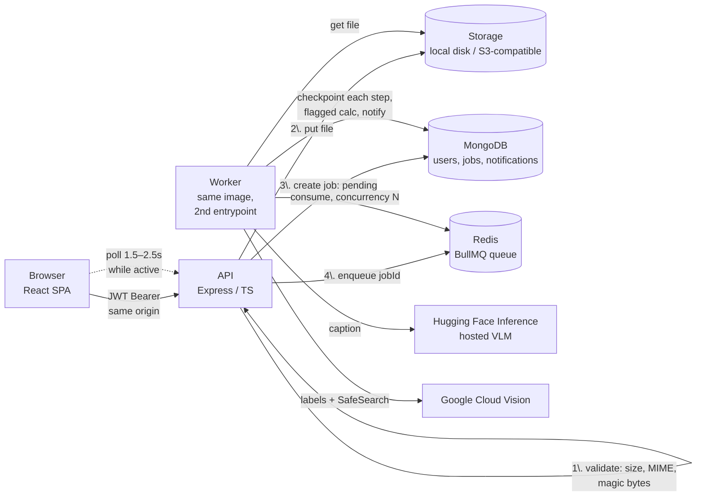
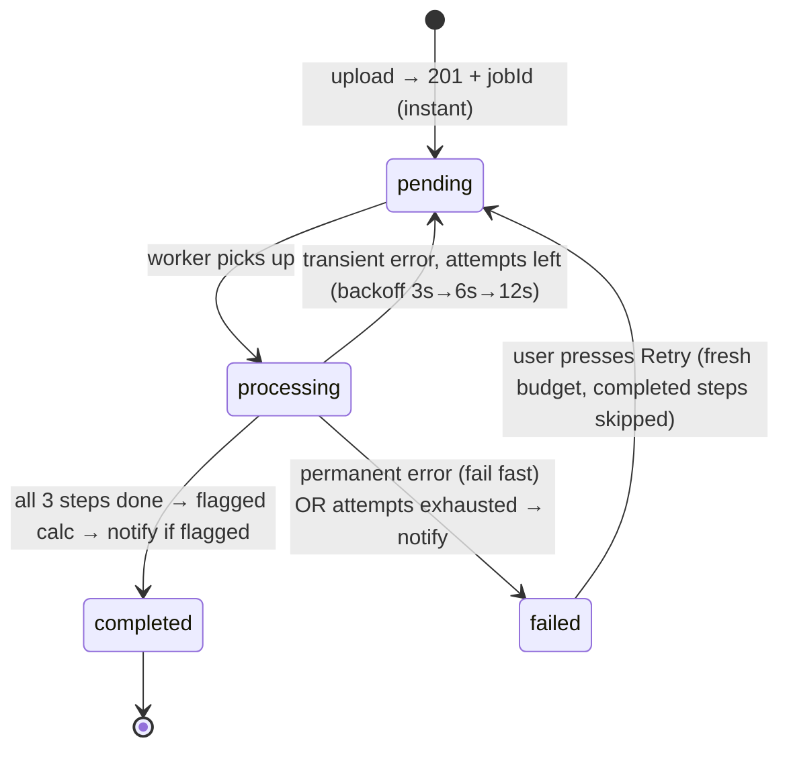

# Darkroom — AI-Powered Media Processing Microservice

Upload images → they're stored durably, queued, and processed **asynchronously** by a worker running a three-step AI pipeline (**caption → labels → safety check**) → enriched results stream into a live-updating UI. Users never wait on AI: uploads return a job ID immediately.

- **Live demo:** _add your deployed URL here after running [deploy/README.md](deploy/README.md)_
- **Deploy guide:** [deploy/README.md](deploy/README.md) — one small VM runs the exact compose stack + Caddy for automatic HTTPS
- **API docs:** `/api/docs` (Swagger UI) · [openapi.yaml](server/openapi.yaml)
- **Decision log:** a full record of every non-obvious choice, its alternatives, and what was deliberately cut — provided as a separate document with the submission ⭐

---

## Quickstart (zero configuration)

```bash
docker compose up --build
# → http://localhost:8080
```

That's the entire setup. The stack starts in **mock AI mode** — deterministic fake providers, no API keys needed — so the full system (API, worker, Redis queue, Mongo) is demoable immediately. Sign up, drop an image, watch the pipeline develop it.

**Switch to real AI** (Hugging Face captioning + Google Vision labels/SafeSearch): create a `.env` next to `docker-compose.yml`:

```env
AI_PROVIDER=real
HF_TOKEN=hf_...        # huggingface.co → Settings → Access Tokens → new "Read" token
GCV_API_KEY=AIza...    # see "Obtaining API keys" below
```

**Demo the failure & moderation flows** (mock mode) — filenames drive scenarios:

| Upload a file named… | What happens | What it demonstrates |
|---|---|---|
| `flagme.png` | SafeSearch returns LIKELY/adult | Flagged badge + safelight bar in list, flagged banner in detail, in-app notification |
| `flaky.png` | Fails attempt 1, succeeds attempt 2 | Automatic retry with exponential backoff |
| `failme.png` | Fails all 3 attempts | Failed state + error surface + manual **Retry** button |
| `badreq.png` | Permanent error | Fail-fast: no retries burned on non-retryable errors |
| anything else | Clean run | caption, labels, safety matrix |

Parallelism: select **multiple files at once** — they process concurrently (`WORKER_CONCURRENCY=4` per worker; `docker compose up --scale worker=3` for more processes).

---

## Architecture



**Job lifecycle** (each step checkpointed to Mongo the moment it completes):



### Why it's shaped this way (short version — full reasoning in the decision log, submitted separately)

| Concern | Choice | The one-line why |
|---|---|---|
| Queue | BullMQ on Redis | Retries/backoff/concurrency/stalled-recovery built in; zero custom retry plumbing (D-001) |
| API ↔ worker split | One package, two entrypoints, one Docker image | They share models/providers/config; separate packages would add tooling for zero gain at this size (D-010) |
| Auth | Stateless JWT + bcrypt | Horizontally scalable, no session store, Postman-friendly (D-002) |
| File storage | Adapter: `local` disk (compose) / any S3-compatible (prod) | Reviewers need zero cloud creds; PaaS containers share no disk (D-003) |
| AI calls | Provider interface, `mock` + `real` | Zero-key local review, deterministic tests, 20-line model swaps when providers shift (D-004) |
| Status updates | Polling that **stops when idle** | 5–15s jobs don't justify a third stateful system (WebSockets); stateless scales (D-006) |
| Flagged notify | In-app notification center | Demoable in compose with zero third-party creds; email is an adapter away (D-007) |
| Retries | Classified errors: transient → backoff retries; permanent → fail fast | HF cold starts make transient failure the *normal* case (D-009) |
| Pipeline state | Per-step checkpoints in Mongo | Retries resume from the failed step — never re-pay for completed AI calls (D-008) |

---

## Failure handling (the part worth reading)

Every provider error is **classified** at the source:

| Failure | Class | Behavior |
|---|---|---|
| HF 503 "model loading" (cold start) | retryable | BullMQ retries the job with exponential backoff; completed steps skip via checkpoints |
| HTTP 429 (rate limit), 5xx, network faults | retryable | same |
| HTTP 401/403 (bad key), 404 (model gone), 400 | permanent | `UnrecoverableError` — fails immediately, no retries burned |
| Unknown/unexpected errors | retryable | transient until proven otherwise; a real bug still exhausts 3 attempts and fails cleanly |
| Stored file missing | permanent | a missing file won't reappear |
| Redis down at upload time | degraded | job saved as `failed (QUEUE_ENQUEUE_FAILED, retryable)` — the file is already durable, the UI Retry recovers it; the request never hangs (5s bounded enqueue) |
| Worker SIGKILLed mid-job | recovered | BullMQ stalled-job detection re-queues; a QueueEvents reconciler keeps Mongo truthful so nothing is stuck `processing` forever |
| Worker SIGTERM (deploy) | graceful | in-flight jobs finish before exit |

Finality is computed from our own attempt counter in Mongo (not queue-library internals), so the retry semantics are deterministic and unit-tested — see [tests/retry.test.ts](server/tests/retry.test.ts).

---

## API

Swagger UI is served by the API at **`/api/docs`**; the raw spec is [server/openapi.yaml](server/openapi.yaml) (imports directly into Postman: *Import → select the yaml*).

| Method | Path | Purpose |
|---|---|---|
| POST | `/api/auth/signup` · `/api/auth/login` | Get a JWT (`Authorization: Bearer <token>` everywhere else) |
| GET | `/api/auth/me` | Session restore |
| POST | `/api/jobs` | Multipart upload → **201 + job immediately** (5MB cap, JPG/PNG/WEBP, magic-byte verified) |
| GET | `/api/jobs?status=&flagged=&page=` | Paginated own-jobs list + `activeCount` (drives polling) |
| GET | `/api/jobs/:id` | Full results: caption, labels, safety matrix, per-step telemetry |
| POST | `/api/jobs/:id/retry` | Re-queue a failed job (completed steps keep their results) |
| GET | `/api/jobs/:id/image` | The stored image (owner-only, streamed after auth) |
| GET | `/api/notifications` · POST `/api/notifications/read` | In-app notification center |
| GET | `/api/health` | Mongo/Redis/AI-mode readiness |

All errors share one shape: `{ "error": { "code": "FILE_TOO_LARGE", "message": "…" } }`.

---

## Environment variables

Everything is validated at boot (zod) — invalid/missing config **fails fast with a named error**, including refusing the default JWT secret in production. Full annotated list: [.env.example](.env.example).

| Variable | Default | Notes |
|---|---|---|
| `MONGO_URI` / `REDIS_URL` | localhost | compose wires these to its own services |
| `JWT_SECRET` | dev default | production boot refuses the default value |
| `MAX_FILE_SIZE_MB` | `5` | enforced at the API layer (413) |
| `STORAGE_DRIVER` | `local` | `local` (shared volume) or `s3` (GCS/R2/B2/MinIO via one code path) |
| `S3_ENDPOINT/BUCKET/ACCESS_KEY_ID/SECRET_ACCESS_KEY` | — | required iff `STORAGE_DRIVER=s3` |
| `AI_PROVIDER` | `mock` | `real` requires the two keys below |
| `HF_TOKEN` | — | Hugging Face read token |
| `HF_CAPTION_URL` / `HF_CAPTION_MODEL` | HF router chat API / `google/gemma-3-4b-it` | swap caption models without code changes (see D-023 for why not BLIP) |
| `GCV_API_KEY` | — | Google Cloud Vision API key |
| `WORKER_CONCURRENCY` | `4` | parallel jobs per worker process |
| `JOB_ATTEMPTS` / `JOB_BACKOFF_MS` | `3` / `3000` | retry budget & exponential backoff base |

### Obtaining API keys (~5 minutes total)

**Hugging Face** (captioning): [huggingface.co](https://huggingface.co) → sign up (free) → *Settings → Access Tokens → Create new token* (type: **Read**) → that's `HF_TOKEN`.

**Google Cloud Vision** (labels + SafeSearch): [console.cloud.google.com](https://console.cloud.google.com) → create/select a project → billing must be enabled (free tier: 1,000 units/month/feature) → *APIs & Services → Library →* enable **Cloud Vision API** → *Credentials → Create credentials → API key* → that's `GCV_API_KEY`. (Recommended: restrict the key to the Vision API.)

---

## Development

```bash
# Full stack:
docker compose up --build

# Or bare-metal against real deps you run yourself:
cd server && npm i && npm run dev:api     # + npm run dev:worker in another shell
cd web && npm i && npm run dev            # Vite on :5173, proxies /api → :8080

# Zero-infra full-product mode (in-memory Mongo + in-process queue driver + mock AI —
# the entire pipeline runs with no Docker/Redis; pair with the Vite dev server):
cd server && npx tsx scripts/dev-standalone.ts
```

### Tests

```bash
cd server && npm test        # 53 tests
```

Coverage targets what the spec calls out — **worker pipeline logic and retry behavior** — plus the validation gates:

- `pipeline.test.ts` — step orchestration, per-step checkpoint resume, flagged mapping (incl. *POSSIBLE does not flag*), idempotent redelivery, notification creation, `markJobFailed` idempotency
- `retry.test.ts` — transient→recovers, permanent→fails fast, exhaustion→failed, unknown-error default, all four mock demo hooks
- `api.test.ts` — upload validation trio (size/MIME/magic bytes), ownership scoping, enqueue-failure degradation, manual-retry reset semantics, notifications, auth
- `imageSniff.test.ts` — magic-byte edge cases

Real Mongo semantics via `mongodb-memory-server`; queue and AI providers are injected fakes — **no network, no Redis** needed in tests. CI (GitHub Actions) runs lint + typecheck + tests + a full Docker build on every push.

---

## Project structure

```
├─ docker-compose.yml     # api + worker + redis + mongo, zero-config
├─ server/                # one package, two entrypoints (D-010)
│  ├─ openapi.yaml        # served at /api/docs
│  ├─ Dockerfile          # multi-stage; SPA baked into the API image
│  └─ src/
│     ├─ api/             # express: routes, middleware, serializers
│     ├─ worker/          # pipeline (checkpointed steps) + retry processor
│     ├─ providers/       # ai/{mock,huggingface,googleVision} · storage/{local,s3}
│     ├─ models/          # User, Job (explicit contract), Notification
│     ├─ queue/           # BullMQ + bounded enqueue/ping
│     └─ config/          # zod-validated env, fail-fast
└─ web/                   # React 19 + Vite + Tailwind v4 + TanStack Query
```

---

## Scalability: how this behaves at 10× (and what breaks first)

*(Analysis, not implementation — per the brief.)*

1. **First bottleneck: external AI quotas/rate limits**, not our infra. GCV free tier is 1,000 units/month/feature; HF free inference is aggressively rate-limited. Adding workers past that point just converts queue depth into 429s. Levers, in order: BullMQ's per-queue rate limiter matched to provider quotas; batch GCV features (labels+SafeSearch in one request — halves round-trips); **content-hash dedupe** (identical bytes → reuse results; big win for platforms with meme-like reuploads); paid tiers.
2. **Workers scale linearly until then** — stateless consumers: `--scale worker=N` in compose, replicas in k8s (queue-depth HPA via KEDA is the natural trigger; manifests in [k8s/](k8s/)).
3. **API scales horizontally already** — stateless JWT, no sessions, no sticky requirements. N replicas behind any LB.
4. **Polling load** grows with concurrent active users (~0.4 req/s each while jobs run, zero when idle). At 10× it's fine (the list query is one indexed read); at 100× swap to SSE/socket.io fanned out via Redis pub/sub — the worker already centralizes every state transition, so the emit point exists.
5. **Image serving through the API** becomes the bandwidth hog: switch the storage adapter to presigned GET URLs + CDN (the seam exists; D-013).
6. **Redis** is the single queue broker: managed Redis with persistence/replica (queue survives broker restarts thanks to AOF locally, RDB+replica in prod).
7. **Mongo**: job docs are small and write patterns are per-step updates on one doc — indexes already cover the hot paths `(userId, createdAt)`, `(status)`, `(flagged)`. Shard-by-userId is the eventual story, far past 10×.

---

## Known limitations & what I'd do with more time

Deliberate cuts, each with full reasoning in the decision log (submitted separately):

- **No email notifications** — in-app only; the notification write is behind one seam, Resend would slot in.
- **No WebSockets/SSE** — polling is the right cost/benefit at 5–15s job durations.
- **No refresh-token rotation / revocation** — 24h expiry bounds it; production auth would add httpOnly refresh cookies.
- **No presigned URLs/CDN, no content-hash dedupe** — the two highest-value scale levers not needed at review scale.
- **No admin/moderation view** for flagged content; out of spec scope.
- **E2E browser tests** skipped in favor of deep unit coverage of pipeline/retry (the spec's stated bar).
- HF serverless model availability shifts over time — `HF_CAPTION_URL` is env-swappable and the provider seam makes a full swap ~20 lines (this is why it exists).
